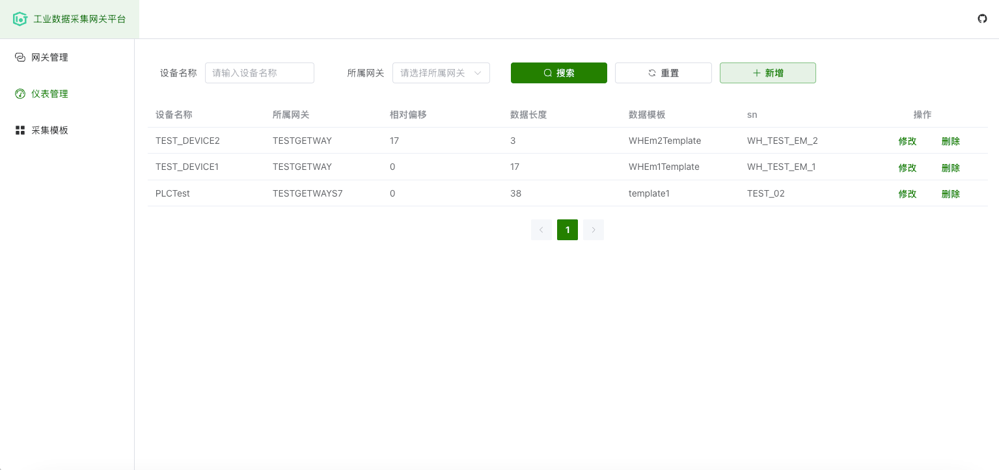

# 🚀 工业数据采集网关平台

> **一个轻量化、多协议、可扩展的工业数据采集网关解决方案**  
> 支持多种工业协议接入、数据缓存与上报、模板化解析，适用于工厂物联网场景。  
> 💡 如果对你有帮助，记得点个 ⭐ Star 哦~

---

## ✨ 功能介绍

### 🔌 协议支持
- **MODBUS TCP** ✅
- **西门子 PLC S7 协议** ✅
- **OPC DA**（通过工具转换为 MODBUS TCP）✅
- **计划支持**：OPC UA / DA 协议 🚧

### 📦 数据缓存与上报
- **Redis 队列缓存**，避免网络异常时数据丢失
- **定时 MQTT 上报**到指定服务器
- 断线重连、数据补发机制

### 🔍 数据解析
- **参数模板绑定**：每个设备绑定一个有序固定寄存器序列
- 按模板自动解析数据，减少重复配置工作

### 🛠️ 项目背景
> 本项目是作者在实际工作中开发的工业网关系统，时间紧任务重 😅，功能不断完善中，欢迎各位老哥一起贡献代码！

---

## 🖼️ 界面预览

#### 网关配置


#### 设备配置


#### 采集模板配置


---

## 🏗️ 环境搭建

### 前端（`gateway_ui`）
- **Node.js** `v20.19.0`
- UI 框架：**Element Plus**
```bash
# 安装依赖
yarn install

# 启动开发环境
yarn dev
```
### 后端
- **Spring Boot 2.6.13**
- 数据库：**PostgreSQL**
- 缓存：**Redis**
- 消息队列：**MQTT**

## 📜 许可证
[MIT License](LICENSE) © 2025

---

## ☕ 请作者喝杯咖啡
如果这个项目对你有帮助，可以请我喝杯咖啡 ❤️

<div style="display: flex; justify-content: center; gap: 20px;">
  
  
</div>
